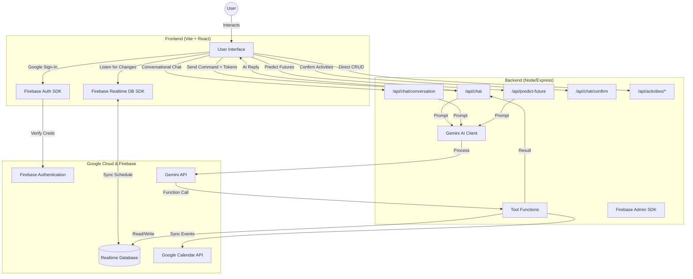

# Technical Architecture

This document outlines the technical details, architecture, and setup instructions for **IF·THEN**.

## System Architecture



---

## Project Structure

```
To-Do/
├── backend/
│   ├── server.js           # Express API routes
│   ├── tools.js             # Firebase & GCal helpers
│   ├── firebase-config.js   # Admin SDK init
│   ├── package.json
│   └── .env                 # GEMINI_API_KEY
│
├── frontend/
│   ├── src/
│   │   ├── App.jsx          # Main router
│   │   ├── main.jsx         # Entry point
│   │   ├── firebase-config.js
│   │   ├── pages/
│   │   │   ├── LandingPage.jsx
│   │   │   ├── Dashboard.jsx    # Timeline view
│   │   │   └── ProfilePage.jsx  # User info + Futures
│   │   ├── components/
│   │   │   ├── Timeline.jsx
│   │   │   ├── ActivityBlock.jsx
│   │   │   ├── ChatInput.jsx
│   │   │   ├── ChatOverlay.jsx
│   │   │   ├── ChatBubble.jsx
│   │   │   ├── DetailsSheet.jsx
│   │   │   └── Header.jsx
│   │   └── hooks/
│   │       └── useAuth.js
│   └── package.json
│
├── README.md
└── architecture.md
```

---

## Features

- **Timeline Visualization**: Horizontal scrolling timeline for daily activities.
- **AI Assistant (Chat)**: Natural language task management (e.g., "Schedule lunch at 12pm").
- **Conversational Life Planner**: Multi-turn chat to build routines from goals.
- **Predicted Futures**: 3 AI-generated scenarios (Baseline, Optimistic, Risk) based on schedule + chat.
- **Google Calendar Sync**: Bidirectional sync with Google Calendar.
- **Realtime Updates**: Firebase RTDB for instant cross-device sync.
- **Secure Authentication**: Google Sign-In via Firebase Auth.

---

## API Endpoints

| Endpoint | Method | Description |
|----------|--------|-------------|
| `/api/chat` | POST | Intent-based task management (add/update/delete) |
| `/api/chat/conversation` | POST | Life planner conversational flow |
| `/api/chat/confirm` | POST | Confirm proposed activities |
| `/api/chat/clear` | POST | Clear conversation history |
| `/api/predict-future` | POST | Generate 3 future scenarios |
| `/api/activities/update` | POST | Direct activity update |
| `/api/activities/delete` | POST | Direct activity delete |
| `/api/debug` | GET | Health check |

---

## Setup Instructions

### Prerequisites
- Node.js (v18+)
- Google Cloud Project with Calendar API enabled
- Firebase Project with Auth & Realtime Database enabled

### Live Deployment
- **Backend**: [https://if-then.onrender.com](https://if-then.onrender.com)
- **Frontend**: Vite build, deployed separately (e.g., Vercel)

### Local Development

1. **Clone the repository**
2. **Backend**:
   ```bash
   cd backend
   npm install
   npm start
   ```
   - Create `.env` with `GEMINI_API_KEY`
   - Place `serviceAccountKey.json` for Firebase Admin
3. **Frontend**:
   ```bash
   cd frontend
   npm install
   npm run dev
   ```
   - Configure `firebase-config.js` with your project credentials

---

## Tech Stack

| Layer | Technology |
|-------|------------|
| Frontend | React, Vite, CSS |
| Backend | Node.js, Express |
| AI | Google Gemini API |
| Auth | Firebase Authentication |
| Database | Firebase Realtime Database |
| Calendar | Google Calendar API |
| Hosting | Render (Backend), Vercel (Frontend) |
